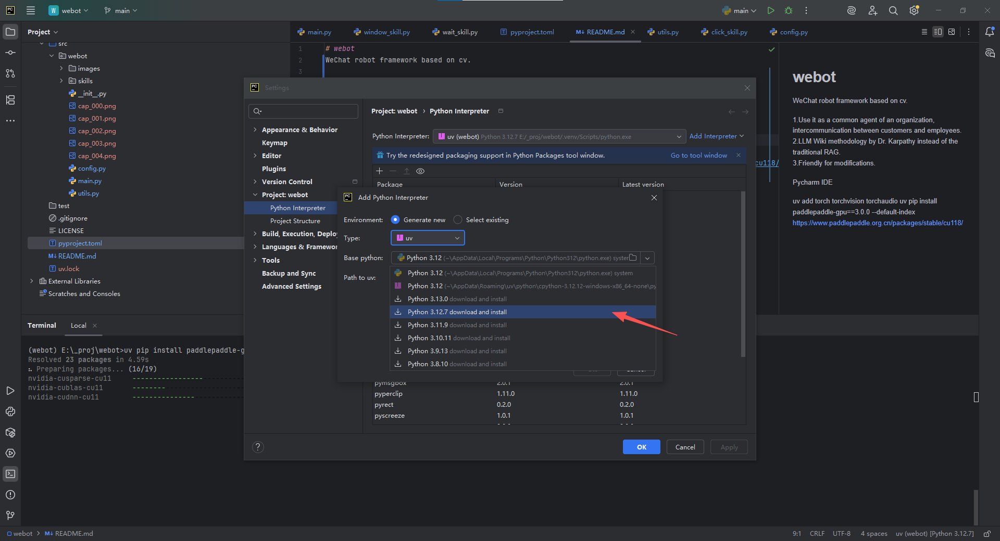

# webot
WeChat robot framework based on cv.

1.Use it as a common agent of an organization, intercommunication between customers and employees.  
2.LLM Wiki methodology by Dr. Karpathy instead of the traditional RAG.  
3.Friendly for modifications.  

## 1.Quick Start
### step 1 Setting up Pycharm IDE.  

### step 2 Some import python packages.  
```commandline
uv add torch torchvision torchaudio
uv pip install paddlepaddle-gpu==3.0.0 --default-index https://www.paddlepaddle.org.cn/packages/stable/cu118/  
uv pip install "paddleocr[all]"
```
### step 3 Give a try.
```python
import paddle
print("CUDA available:", paddle.is_compiled_with_cuda())
```