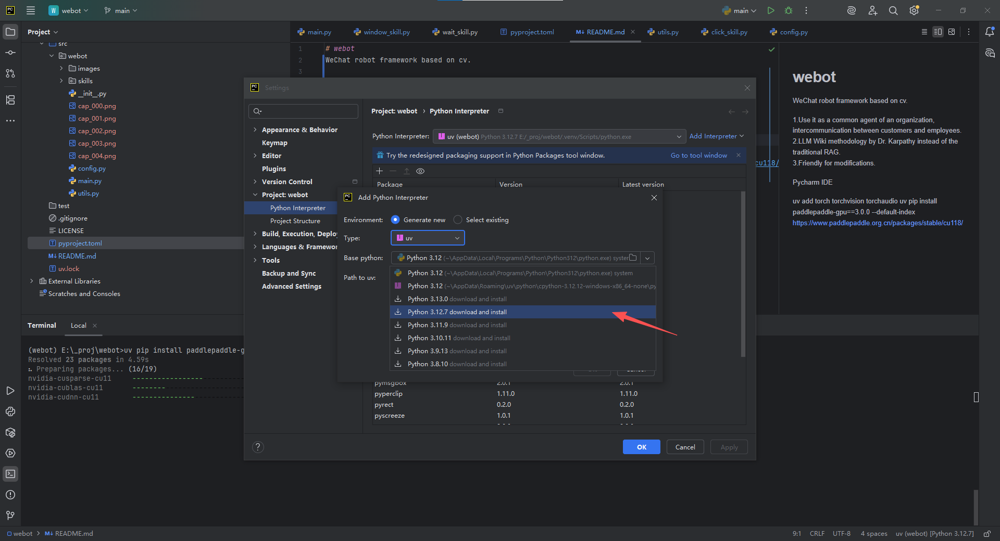

# webot
WeChat robot framework based on cv.

1.Use it as a common agent of an organization, intercommunication between customers and employees.  
2.LLM Wiki methodology by Dr. Karpathy instead of the traditional RAG.  
3.Friendly for modifications.  

## 1.Quick Start
### step 1 Setting up Pycharm IDE.  

### step 2 Some import python packages.  
```commandline
uv add torch torchvision torchaudio
uv pip install paddlepaddle-gpu==3.0.0 --default-index https://www.paddlepaddle.org.cn/packages/stable/cu118/  
uv pip install "paddleocr[all]"
```
### step 3 Give a try.
```python
import paddle
print("CUDA available:", paddle.is_compiled_with_cuda())
```

## 2.Design Consideration
### 2.1AgentLoop的ticker
（1）UI层的Timer会5秒一次触发，在窗口的事件处理函数中，主要功能是调用AgentLoop的ticker函数，根据结果绘制到界面上。  
（2）UI窗口创建的时候会附带AgentLoop的实例agent被创建。UI起来之后，点击“开始监控”按钮，定时器启动，“停止监控”，定时器关闭。  
（3）AgentLoop的ticker函数完成核心功能是每个ticker周期观察一次界面（发现红点），产生任务。按照目前的机制，Agent起来之前的红点不处理，只记录到_seen_chats中，只有是Agent运行起来之后，新到来的消息，Agent才会根据rules.json中设置的哪些联系人以及群需要自动回复，以及回复的规则去处理。
【注意】这个设计是比较合理的，就是尽量让新消息由人去处理而不是Agent已启动，就把所有消息都自动处理掉。  
（4）Agent目前处理消息是每次处理一个联系人，在_handle_one中处理。这个函数内部再按照模板处理或者大模型处理。
### 2.2微信操作技巧
（1）发送文件，需要利用QT6的Mimedata，设置为剪切板格式。  
（2）保存文件，需要利用QT6的Mimedata，直接粘贴到文件夹（import shutil）。  
（3）当激活窗口等操作后，最好要等个半秒时间，再进行截图、图片特征查找等操作，不然容易失败（刷新不及时）。  
（4）关于logger的知识点：logging.logging.getLogger(name)，是一个工厂单例范式，只要name相同，会返回同样一个logger，不会给新的。如果name是a.b.c这种，会自动建立logger的层次关系，底层继承上层的LEVEL。但不会继承handler、formatter、filter等。子层logger如果有handler，则用handler处理日志，然后把消息往父级logger传播。  
（5）
