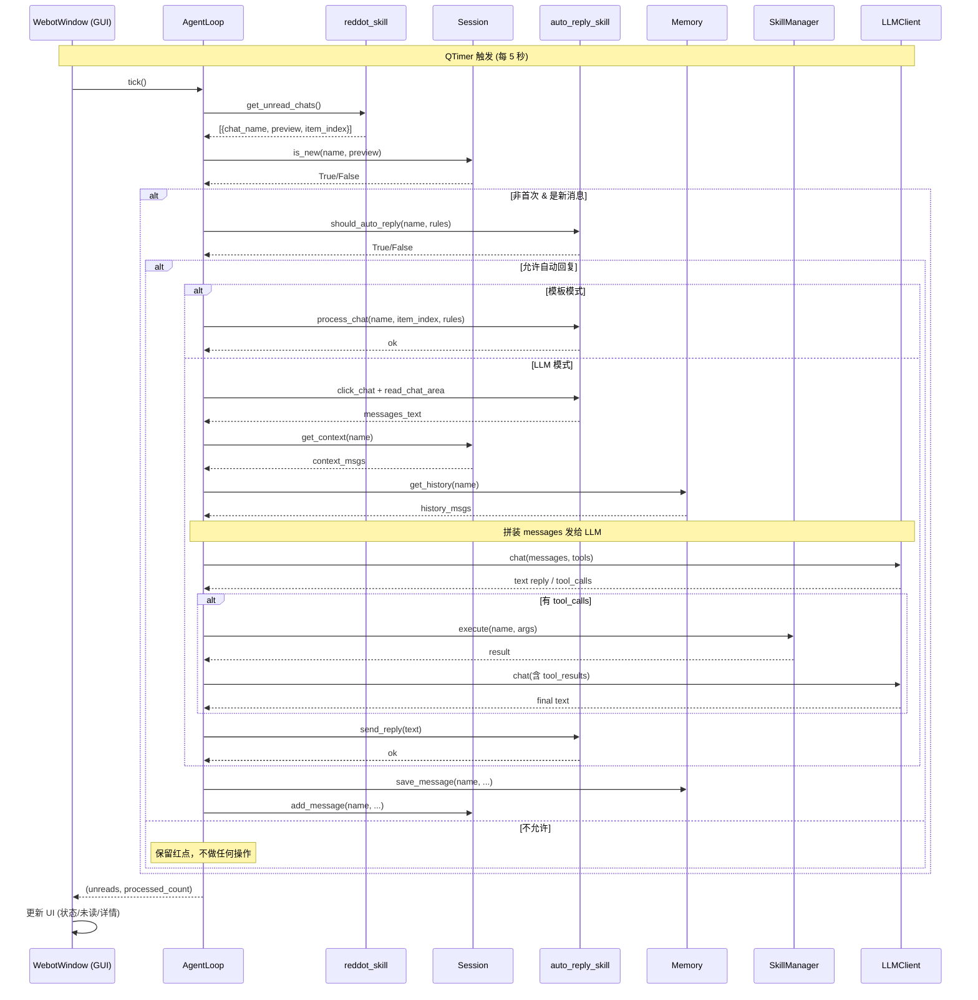
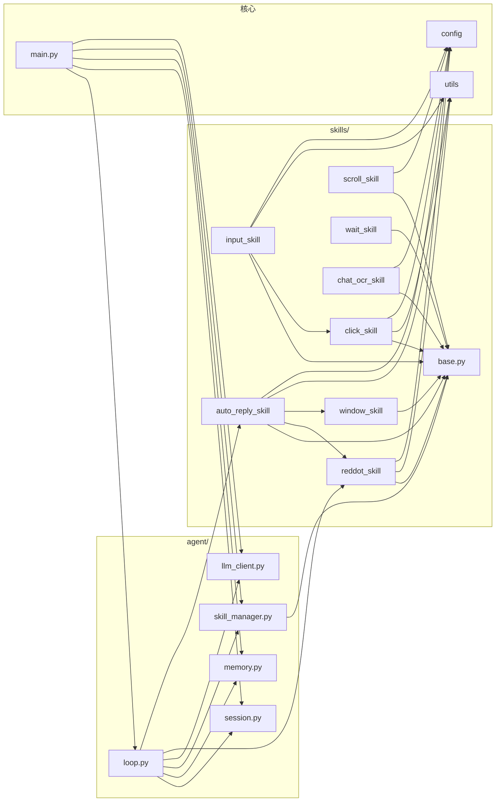
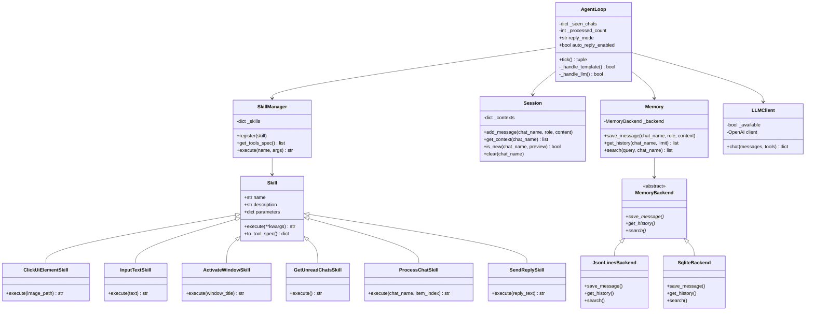

# 系统架构图

## 1. 整体项目结构

```mermaid
graph TB
    subgraph Entry["入口层"]
        WE[webot 命令<br/>pyproject.toml → webot.main:main]
    end

    subgraph GUI["GUI 层 (PyQt6)"]
        MW["main.py / WebotWindow<br/>QMainWindow"]
        QTE["QTextEdit<br/>操作日志"]
        BTN["开始/停止<br/>并排显示等按钮"]
        CMB["回复模式下拉框<br/>模板/LLM/降级"]
        TM["QTimer<br/>定时驱动 AgentLoop.tick()"]
    end

    subgraph Agent["Agent 核心包 (agent/)"]
        AL["loop.py / AgentLoop<br/>主调度引擎"]
        SESS["session.py / Session<br/>会话上下文"]
        MEM["memory.py / Memory<br/>+ JsonLinesBackend<br/>+ SqliteBackend"]
        SM["skill_manager.py / SkillManager<br/>注册 + LLM tool calling 路由"]
        LLM["llm_client.py / LLMClient<br/>DeepSeek API 封装"]
    end

    subgraph Skills["技能层 (skills/)"]
        BASE["base.py / Skill<br/>抽象基类"]
        CLICK["click_skill.py<br/>ClickUiElementSkill"]
        INPUT["input_skill.py<br/>InputTextSkill"]
        WIN["window_skill.py<br/>ActivateWindowSkill"]
        SCROLL["scroll_skill.py<br/>ScrollRepeatedlySkill"]
        WAIT["wait_skill.py<br/>WaitForUserFocusSkill"]
        OCR["chat_ocr_skill.py<br/>ReadChatHistorySkill"]
        RED["reddot_skill.py<br/>GetUnreadChatsSkill"]
        AR["auto_reply_skill.py<br/>ProcessChatSkill<br/>SendReplySkill"]
    end

    subgraph Common["公共模块"]
        CFG["config.py<br/>配置常量"]
        UTIL["utils.py<br/>日志 + get_image_path"]
        CP["command_parser.py<br/>CommandParser"]
    end

    subgraph Data["数据存储"]
        RULES["rules.json<br/>回复规则"]
        MEMFILE["memory.jsonl / .db<br/>长期记忆"]
        ENV[".env<br/>DeepSeek API Key"]
        IMG["images/*.png<br/>模板图片"]
    end

    subgraph External["外部依赖"]
        PC["pyautogui + pyscreeze<br/>屏幕截图/点击"]
        PW["pygetwindow<br/>窗口管理"]
        POC["PaddleOCR<br/>文字识别"]
        DS["DeepSeek API<br/>LLM 推理"]
        QT["PyQt6<br/>GUI 框架"]
    end

    %% 连线
    WE --> MW
    MW --> TM
    TM --> AL
    MW --> QTE & BTN & CMB
    BTN --> AL
    CMB --> AL

    AL --> SESS
    AL --> MEM
    AL --> SM
    AL --> LLM
    AL --> AR
    AL --> RED

    SM --> BASE
    CLICK & INPUT & WIN & SCROLL & WAIT & OCR & RED & AR -.->|继承| BASE
    SM --> CLICK & INPUT & WIN & SCROLL & WAIT & OCR & RED & AR

    CLICK & INPUT & WIN & SCROLL & WAIT & RED --> PC
    WIN --> PW
    OCR & RED --> POC
    LLM --> DS
    MW & AL & AR --> CFG & UTIL
    MW --> CP

    AR --> RULES
    MEM --> MEMFILE
    LLM --> ENV
    CLICK & INPUT --> IMG

    MW -.-> QT
```

## 2. 运行时数据流（Agent 轮询一次）

```mermaid
sequenceDiagram
    participant GUI as WebotWindow (GUI)
    participant AL as AgentLoop
    participant RD as reddot_skill
    participant SESS as Session
    participant AR as auto_reply_skill
    participant MEM as Memory
    participant SM as SkillManager
    participant LLMC as LLMClient

    Note over GUI,LLMC: QTimer 触发 (每 5 秒)

    GUI->>AL: tick()
    AL->>RD: get_unread_chats()
    RD-->>AL: [{chat_name, preview, item_index}]

    AL->>SESS: is_new(name, preview)
    SESS-->>AL: True/False

    alt 非首次 & 是新消息
        AL->>AR: should_auto_reply(name, rules)
        AR-->>AL: True/False

        alt 允许自动回复
            alt 模板模式
                AL->>AR: process_chat(name, item_index, rules)
                AR-->>AL: ok
            else LLM 模式
                AL->>AR: click_chat + read_chat_area
                AR-->>AL: messages_text
                AL->>SESS: get_context(name)
                SESS-->>AL: context_msgs
                AL->>MEM: get_history(name)
                MEM-->>AL: history_msgs
                Note over AL,LLMC: 拼装 messages 发给 LLM
                AL->>LLMC: chat(messages, tools)
                LLMC-->>AL: text reply / tool_calls
                alt 有 tool_calls
                    AL->>SM: execute(name, args)
                    SM-->>AL: result
                    AL->>LLMC: chat(含 tool_results)
                    LLMC-->>AL: final text
                end
                AL->>AR: send_reply(text)
                AR-->>AL: ok
            end
            AL->>MEM: save_message(name, ...)
            AL->>SESS: add_message(name, ...)
        else 不允许
            Note over AL: 保留红点，不做任何操作
        end
    end

    AL-->>GUI: (unreads, processed_count)
    GUI->>GUI: 更新 UI (状态/未读/详情)
```

## 3. 模块依赖关系

```mermaid
graph LR
    subgraph sk["skills/"]
        CLICK[click_skill]
        INPUT[input_skill]
        WIN[window_skill]
        SCROLL[scroll_skill]
        WAIT[wait_skill]
        OCR[chat_ocr_skill]
        RED[reddot_skill]
        AR[auto_reply_skill]
        BASE[base.py]
    end

    subgraph ag["agent/"]
        LP[loop.py]
        SS[session.py]
        MM[memory.py]
        SKM[skill_manager.py]
        LLM[llm_client.py]
    end

    subgraph core["核心"]
        CFG[config]
        UTL[utils]
        MP[main.py]
    end

    MP --> LP & SS & MM & SKM & LLM
    LP --> SS & MM & SKM & LLM
    LP --> RED & AR
    SKM --> BASE
    CLICK & INPUT & WIN & SCROLL & WAIT & OCR & RED & AR --> BASE
    CLICK --> UTL
    INPUT --> CLICK & UTL
    AR --> RED & WIN & UTL
    RED --> UTL
    CLICK & INPUT & SCROLL & OCR --> CFG
    AR & RED --> CFG
```

## 4. 关键类结构

```mermaid
classDiagram
    class Skill {
        +str name
        +str description
        +dict parameters
        +execute(**kwargs) str
        +to_tool_spec() dict
    }

    class ClickUiElementSkill {
        +execute(image_path) str
    }
    class InputTextSkill {
        +execute(text) str
    }
    class ActivateWindowSkill {
        +execute(window_title) str
    }
    class GetUnreadChatsSkill {
        +execute() str
    }
    class ProcessChatSkill {
        +execute(chat_name, item_index) str
    }
    class SendReplySkill {
        +execute(reply_text) str
    }

    class SkillManager {
        -dict _skills
        +register(skill)
        +get_tools_spec() list
        +execute(name, args) str
    }

    class Session {
        -dict _contexts
        +add_message(chat_name, role, content)
        +get_context(chat_name) list
        +is_new(chat_name, preview) bool
        +clear(chat_name)
    }

    class Memory {
        -MemoryBackend _backend
        +save_message(chat_name, role, content)
        +get_history(chat_name, limit) list
        +search(query, chat_name) list
    }

    class MemoryBackend {
        <<abstract>>
        +save_message()*
        +get_history()*
        +search()*
    }

    class JsonLinesBackend {
        +save_message()
        +get_history()
        +search()
    }

    class SqliteBackend {
        +save_message()
        +get_history()
        +search()
    }

    class LLMClient {
        -bool _available
        -OpenAI client
        +chat(messages, tools) dict
    }

    class AgentLoop {
        -dict _seen_chats
        -int _processed_count
        +str reply_mode
        +bool auto_reply_enabled
        +tick() tuple
        -_handle_template() bool
        -_handle_llm() bool
    }

    Skill <|-- ClickUiElementSkill
    Skill <|-- InputTextSkill
    Skill <|-- ActivateWindowSkill
    Skill <|-- GetUnreadChatsSkill
    Skill <|-- ProcessChatSkill
    Skill <|-- SendReplySkill
    SkillManager --> Skill
    AgentLoop --> SkillManager
    AgentLoop --> Session
    AgentLoop --> Memory
    AgentLoop --> LLMClient
    Memory --> MemoryBackend
    MemoryBackend <|-- JsonLinesBackend
    MemoryBackend <|-- SqliteBackend
```
